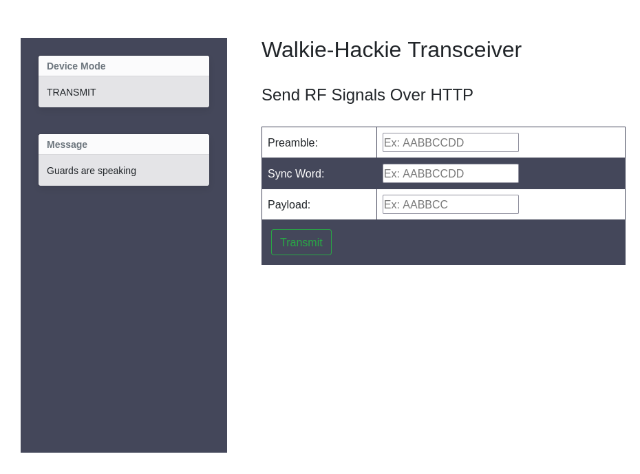
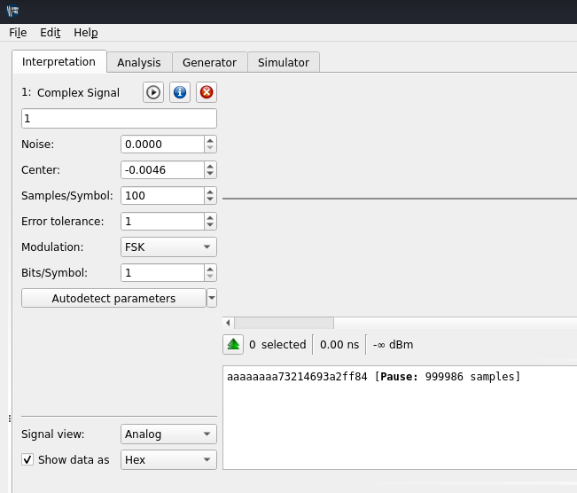

# Walkie Hackie
Rating: *Very Easy*

> Our agents got caught during a mission and found that the guards are using old walkie-talkies for their communication. The field team captured their transmissions. Can you interrupt their communication to help our agents escape from the guards?

I am given 4 files (`1.complex`, `2.complex`, `3.complex`, `4.complex`) and a this web interface: 

Using [Universal Radio Hacker](https://github.com/jopohl/urh) I can analyze these `.complex` files and see

Usually, you might see some encoding or some kind of redundancy thrown in to help with clock recovery and error correction. But here is nothing of that...this signal is just raw.
There’s a pattern at the start — a sync sequence to help the receiver lock onto the sender's clock.

Each Signal starts with **preamble** ("aaaaaaaa") , then there is a **sync word** ("73214693") and then the **payload** ("a2ff84" or "a1ff14" or "b1ff57" or "b2ff24" for each `.complex` file). 

Now to find the correct combination.

First I created the list for hex values and then I used the `ffuz` to do this.

`ffuf -w list_walkie_hackie:AA -w list_walkie_hackie:BB -u http://URL:PORT/transmit -d 'pa=aaaaaaaa&sw=73214693&pl=AAffBB' -H 'Content-Type: application/x-www-form-urlencoded'`

... and then use any combination that returns response 200 in the web interface (or `curl` it).

